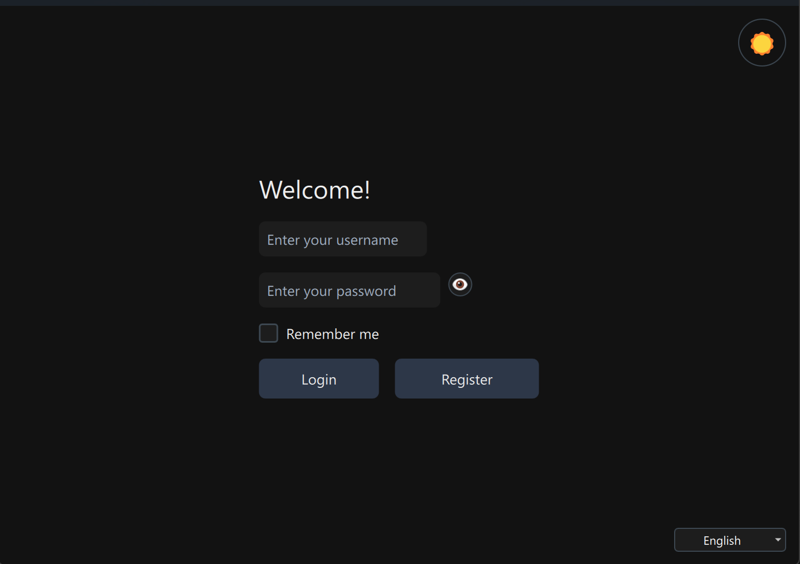
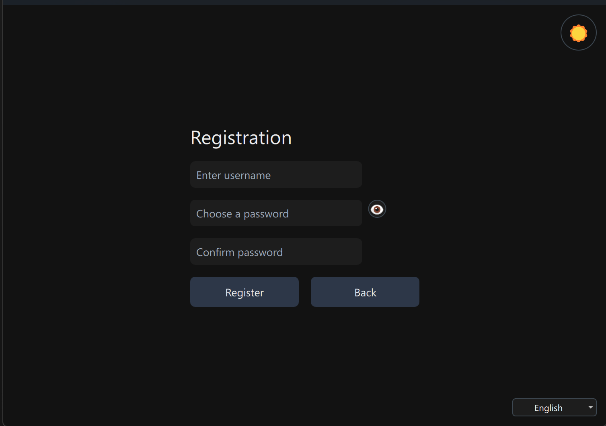
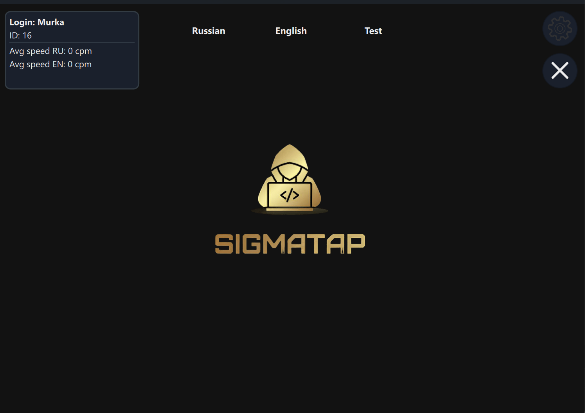
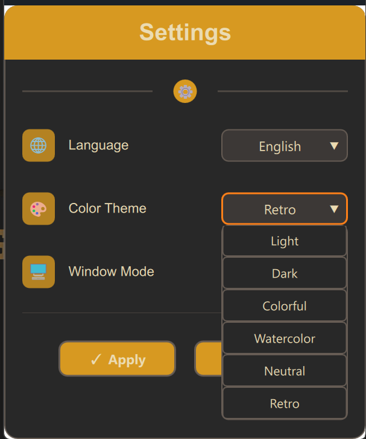
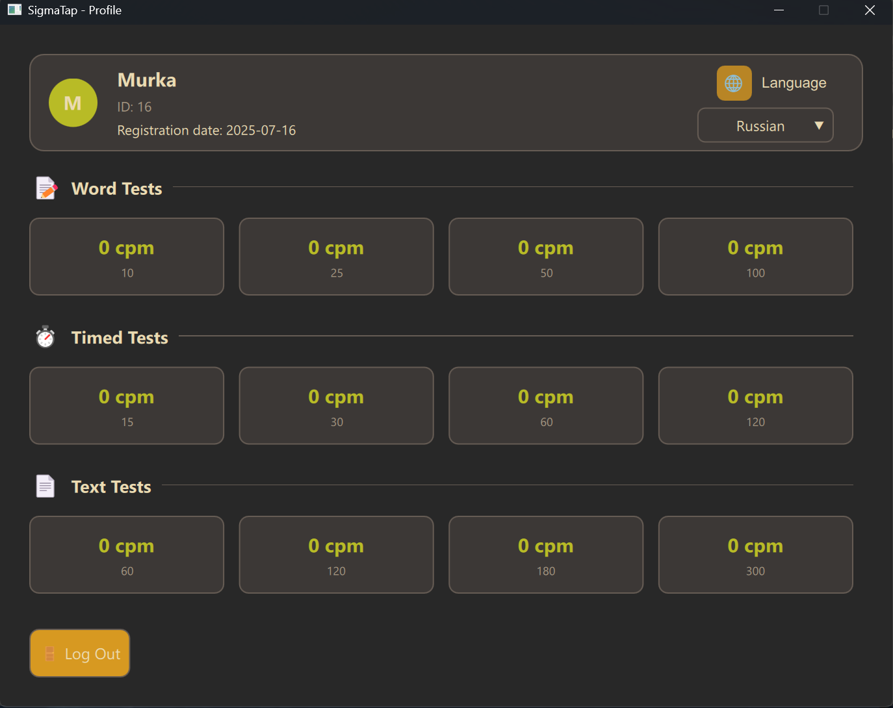
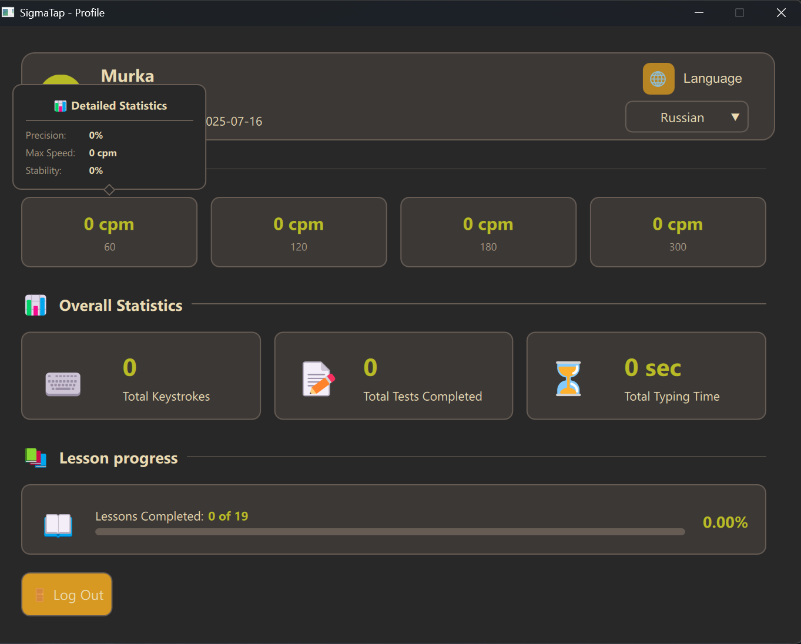
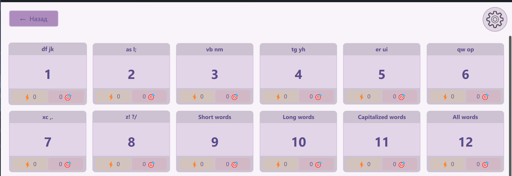
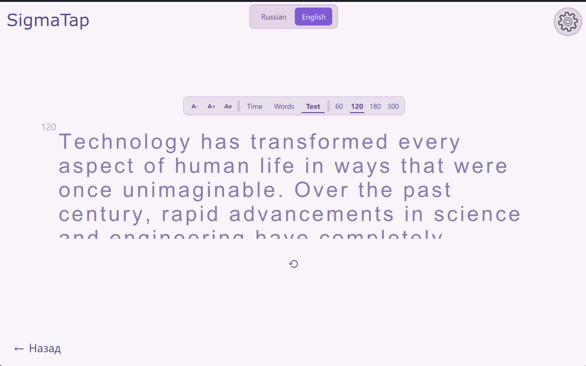

# SigmaTap — Keyboard Trainer

**SigmaTap** is a convenient and multifunctional trainer for learning and practicing typing. It supports two languages and multiple training modes, allows you to track progress, and customize the appearance.

[README.md](README.md)

## Contents

1. [Project Description](#project-description)  
2. [Screenshots](#screenshots)  
3. [Features](#features)  
4. [Available Modes](#available-modes)  
5. [Lesson Details](#lesson-details)  
6. [Settings](#settings)  
7. [Progress Tracking](#progress-tracking)  
8. [Installation and Running](#installation-and-running)  
9. [Future Plans](#future-plans)  
10. [Tools Used](#tools-used)  
11. [Contacts](#contacts)  

## Project Description

SigmaTap is a keyboard trainer designed to improve typing skills. The program offers lessons and practice exercises in two languages, as well as various speed and accuracy tests.

## Screenshots

<p>
  <a href="Img/Login.png"></a>
  <a href="Img/Registration.png"></a>
  <a href="Img/MainMenu.png"></a>
  <a href="Img/Settings.png"></a>
  <a href="Img/ProfileOne.png"></a>
  <a href="Img/ProfileTwo.png"></a>
  <a href="Img/Lessons.png"></a>
  <a href="Img/Lesson.png"></a>
  <a href="Img/Tests.png"></a>
</p>

---

## Features

- Lessons and practice in two languages  
- Various tests:  
  - Typing a set number of words  
  - Timed typing  
  - Words with or without numbers and punctuation  
  - Timed full text typing  
- Adjustable text size and font  
- Progress tracking for lessons  
- Monitoring typing speed in tests  
- Theme, interface language, and window mode settings  

## Available Modes

- Lessons (starting with basic ones, improvements planned)  
- Practice tests (variety of options for training)  

## Lesson Details

- Lessons are available in two languages  
- Current version lessons need improvement  
- Lessons provide basic introduction to the keyboard and skill development  

## Settings

Users can customize:  
- Theme (light/dark and other options)  
- Interface language  
- Window mode (e.g., fullscreen or windowed)  
- Text size and font for comfortable use  

## Progress Tracking

- Records results for each lesson and test  
- Graphs and statistics for typing speed and accuracy  
- Ability to analyze progress and set goals  

## Installation and Running

You can install the program from the releases by clicking the appropriate link in the [Releases](https://github.com/MuraSaichick/keyboard-trainer/releases) section.

### If you want to run from source:

1. Clone the repository:
    ```bash
   git clone https://github.com/MuraSaichick/SigmaTap.git
2. Open the project in QtCreator 15.0.1.

3. Build the project using Qt 6.8.2 and CMake.

4. Run the application directly from QtCreator or from the built folder.

## Tools Used

The following technologies and tools were used in the SigmaTap project:

- **Qt 6.8.2** — main framework for UI and application logic development  
- **QtCreator 15.0.1** — integrated development environment (IDE) for Qt projects  
- **CMake** — build automation system  
- **QML** — language for describing user interface  
- **C++17 (standard 201703)** — programming language for application logic and performance  
- **SQLite 3.0** — lightweight embedded database for storing progress and user data  
- **SQLiteStudio** — tool for managing and viewing SQLite databases  

---

This file can be updated if new tools or libraries are added.

## Future Plans

- Interface improvements  
- Adding typing sounds  
- Option to change cursor  
- Enhancing settings functionality  
- Adding practice for coding speed typing  
- Expanding language support  

## Contacts

<p>
  
  <strong style="font-size:16px;">Gmail:</strong>
  <a href="mailto:Brawl2554@gmail.com" style="font-size:16px; text-decoration: none;">Brawl2554@gmail.com</a>
</p>

<p>
  
  <strong style="font-size:16px;">Telegram:</strong>
  <a href="https://t.me/MuraSaichick" style="font-size:16px; text-decoration: none;">@MuraSaichick</a>
</p>
