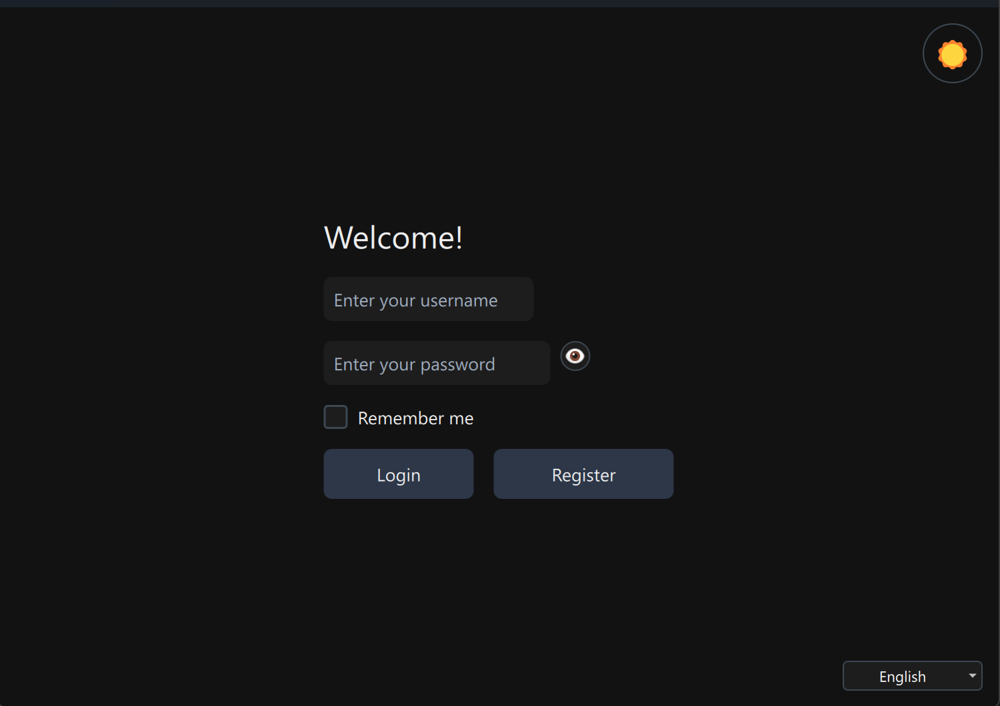
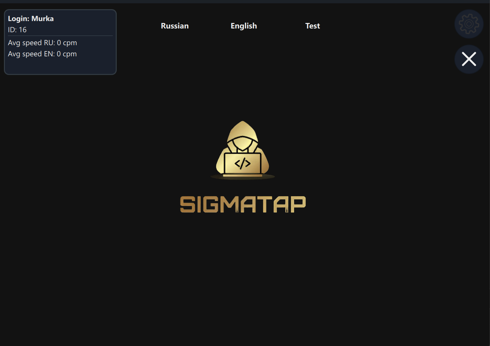
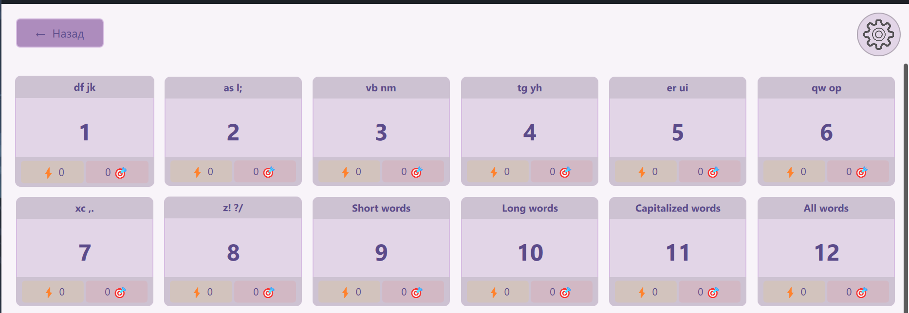
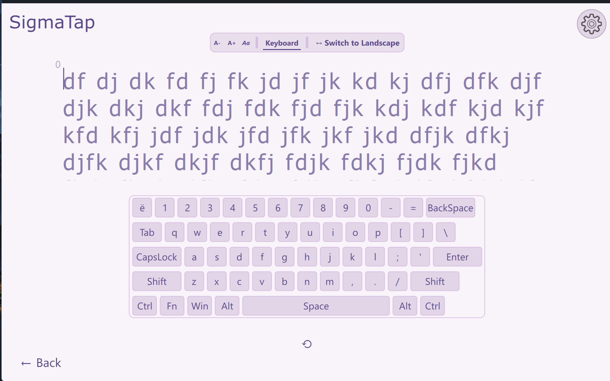

# SigmaTap — клавиатурный тренажер

**SigmaTap** - удобный и многофункциональный тренажер для обучения и практики печати на клавиатуре. Поддерживает два языка и несколько режимов тренировки, позволяет отслеживать прогресс и настраивать внешний вид.

[README.md](README.md)

## Содержание

1. [Описание проекта](#описание-проекта)
2. [Скриншоты](#скриншоты)
3. [Функциональные возможности](#функциональные-возможности)
4. [Доступные режимы](#доступные-режимы)  
5. [Особенности уроков](#особенности-уроков)  
6. [Настройки](#настройки)  
7. [Отслеживание прогресса](#отслеживание-прогресса)  
8. [Установка и запуск](#установка-и-запуск)
9. [Планы по развитию](#планы-по-развитию) 
10. [Используемые инструменты](#используемые-инструменты)
11. [Контакты](#контакты)  

## Описание проекта

SigmaTap - это клавиатурный тренажер, предназначенный для улучшения навыков печати. Программа предлагает уроки и практические задания на двух языках, а также разнообразные тесты на скорость и точность.

## Скриншоты
<p>
  <a href="Img/Login.png"></a>
  <a href="Img/Registration.png"></a>
  <a href="Img/MainMenu.png"></a>
  <a href="Img/Settings.png"></a>
  <a href="Img/ProfileOne.png"></a>
  <a href="Img/ProfileTwo.png"></a>
  <a href="Img/Lessons.png"></a>
  <a href="Img/Lesson.png"></a>
  <a href="Img/Tests.png"></a>
</p>


## Функциональные возможности

- Уроки и практика на двух языках  
- Разнообразные тесты:  
  - Печатание заданного количества слов  
  - Печать на время  
  - Слова с цифрами и пунктуацией или без них  
  - Печать полного текста на время  
- Настройка размера и шрифта текста  
- Отслеживание прогресса уроков  
- Мониторинг скорости печати на тестах  
- Настройки темы оформления, языка интерфейса и режима окна  

## Доступные режимы

- Уроки (начинаются с базовых, но планируется улучшение)  
- Практические тесты (многообразие вариантов для тренировки)  

## Особенности уроков

- Уроки представлены на двух языках  
- В текущей версии уроки нуждаются в доработке  
- Уроки служат для базового ознакомления с клавиатурой и формированием навыков  

## Настройки

Пользователь может настроить:  
- Тему (светлая/тёмная и другие варианты)  
- Язык интерфейса  
- Режим окна (например, полноэкранный или оконный)  
- Размер и шрифт текста для комфортной работы  

## Отслеживание прогресса

- Запись результатов по каждому уроку и тесту  
- Графики и статистика скорости печати и точности  
- Возможность анализа собственных достижений и постановки целей  

## Установка и запуск

Установить программу можно из релизов, нажав на соответствующую ссылку в разделе [Releases](https://github.com/MuraSaichick/keyboard-trainer/releases).

### Если хотите запустить из исходников:

1. Клонируйте репозиторий:  
   ```bash
   git clone https://github.com/MuraSaichick/SigmaTap.git
2. Откройте проект в QtCreator 15.0.1.

3. Соберите проект с использованием Qt 6.8.2 и CMake.

4. Запустите приложение напрямую из QtCreator или из собранной папки.

## Используемые инструменты

В проекте SigmaTap применялись следующие технологии и инструменты:

- **Qt 6.8.2** — основной фреймворк для разработки интерфейса и логики приложения  
- **QtCreator 15.0.1** — интегрированная среда разработки (IDE) для работы с Qt-проектами  
- **CMake** — система автоматизации сборки проекта  
- **QML** — язык описания интерфейса пользователя  
- **C++17 (стандарт 201703)** — язык программирования для логики приложения и производительности  
- **SQLite 3.0** — легковесная встроенная база данных для хранения прогресса и данных пользователя  
- **SQLiteStudio** — инструмент для управления и просмотра SQLite баз данных  

---

Если будут добавляться новые инструменты или библиотеки, этот файл можно обновить.

## Планы по развитию

- Улучшениe интерфейса  
- Добавление звуков при печати 
- Возможность изменения курсора 
- Улучшение функциональности настроек  
- Добавление практики по скорости печати кода  
- Расширение поддержки языков

## Контакты

<p>
  
  <strong style="font-size:16px;">Gmail:</strong>
  <a href="mailto:Brawl2554@gmail.com" style="font-size:16px; text-decoration: none;">Brawl2554@gmail.com</a>
</p>

<p>
  
  <strong style="font-size:16px;">Telegram:</strong>
  <a href="https://t.me/MuraSaichick" style="font-size:16px; text-decoration: none;">@MuraSaichick</a>
</p>